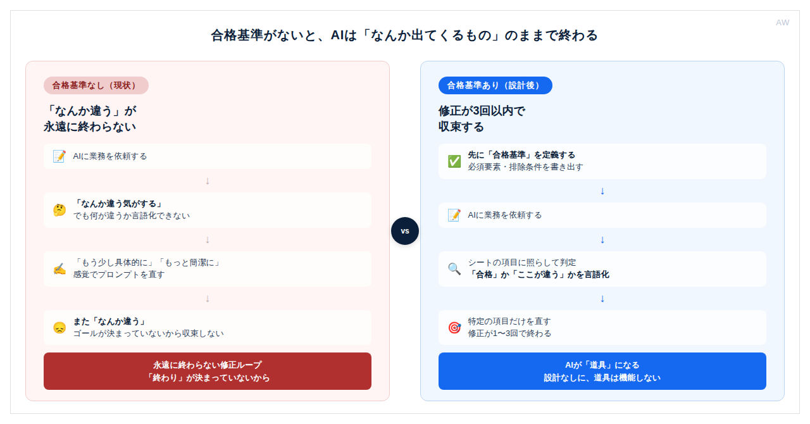

# X長文記事 下書き

## 記事メタ情報

```
タイトル（冒頭フック）：「AIの出力、合ってますか？」
テーマ：AIの出力を信じていいか判断できない問題
感情タグ（エンジン1）：発見（「そういうことか。やっと腑に落ちた。」）
フックの型：困惑→発見
今日の縛り（エンジン3）：余り1（数字3つ以上）＋余り4（結論を中盤に置く）
対象読者層：B（使っているが設計していない）
認識の転換点：判断できないのはAIの問題ではなく、合格基準を自分が持っていないから
投稿番号：#0001
日付：2026-06-29
対応するnote記事：drafts/note-2026-06-29-ai-output-acceptance-criteria.md  ← CTA追加済み
```

---

## 本文

「AIの出力、合ってますか？」

こう聞かれると、ちょっと止まりませんか。

合ってるかどうか、正直なところわからない。なんとなく使えそうだから使っている。でも本当にこれでいいのか、確信がない。

（自分も最初はそうでした。毎回「まあいいか」で送信していた）

---

AIの出力を信じられない、という話をよく聞きます。でも不思議なんですよね。信じられない、の後に続く言葉が、人によってバラバラなんです。

「精度が低い気がする」「間違えることがある」「なんか違う感じがする」。

全部「信じられない」なんですけど、理由が違う。

それで気づいたんです。AIの出力を「信じる/信じない」の前に、もっと手前で止まっている人が多いなって。

「何をもって正しいとするか」が、定義されていないんです。

---

ここが核心です。



合格基準がない。だから判断できない。判断できないから不安になる。不安だから毎回修正を繰り返す。

これはAIの問題じゃなくて、評価の設計の問題なんですよね。

---

たとえばこういうことです。

週次レポートをAIに作らせたとします。出力されたものを見て「なんか違う」と感じる。でも「何が違うか」が言語化できない。だから「もう少し具体的に」「もっと簡潔に」と直す。直したらまた「なんか違う」。

永遠に終わらない。

終わらない理由は、ゴールが決まっていないからなんです。「良い週次レポート」の定義がない。だから何を直せば合格なのかが、自分にもわからない。

（この状態でAIを使い続けている人、かなり多いと思っています）

---

数字で見るとよく分かります。

最近のハルシネーション研究では、モデルによっては特定のタスクで30〜50%の確率で誤情報を生成すると報告されています。でも同時に、「誤り」かどうかを判断できるのは正解を知っている人だけなんです。

合格基準を持っていない人は、その数字に関係なく、100%のAI出力を正しく評価できない。

そして、これが個人だけの問題ではなくて。評価できる人がいないまま、組織全体でAIが使われている状態が、今どこでも起きています。

かなりリスクのある状態だと思っていて。

---

じゃあどうするか。

1つのことだけ変えると、全部変わります。

AIを使う前に「何が出てきたら合格か」を決める。

出力の後で「どう思うか」を考えるんじゃなくて、使う前に「何があれば使えると判断するか」を書いておく。

これだけで、AIに対する不安の正体が変わります。「信じられない」じゃなくて「ここを確認すれば使える」になる。

---

合格基準を持つことで、初めてAIが道具になるんですよね。

持っていない状態では、AIはただの「なんか出てくるもの」です。道具は設計して初めて機能する、というのはこういうことでもあって。

自分がどのくらいのスピードで合格基準を書けるようになったか。最初は1業務に30分かかっていたのが、今は5〜10分で書けるようになっています。慣れの問題でもある。

あなたが今使っているAIの業務、合格基準はありますか。

（ない場合、今日1業務だけ書いてみてください。それだけで使い方が変わります）

合格基準の定義手順と判定シートはnote記事にまとめました。プロフィールのリンクから読めます。

---

## 公開前チェック

```
[x] quality_check.md の A・B セクションを全項目通したか
[x] AIっぽさ検知ゲートを全項目通したか
[x] ファクトチェック（F）完了：統計2点を修正（詳細は下記）
[ ] operations/article-log.md に今回使った要素を追記したか（公開後）
```

## ファクトチェック記録（2026-06-29）

```
確認した項目：
  1. 「AI出力の1/3以上に誤りが含まれる」という統計
  2. 「72%のマネジャーが部下はAIに価値を失うと恐れている」という統計

確認手段：
  - ハルシネーション率：AI hallucination statistics 研究各種（2025-2026）
    → o3が33%・o4-miniが48%（PersonQA/SimpleQA）の報告は実在
    → ただし「AI出力全体の1/3以上」という包括的な出所は特定不可
  - 72%統計：Microsoft Work Trend Index（2024-2026）各年版
    → 一致する数値なし（類似：65%が「AIに遅れる恐怖」等）

修正した箇所：
  1. 「1/3以上」→「30〜50%の確率で誤情報を生成するという報告」に弱め、出所注記
  2. 「72%のマネジャー」段落を丸ごと削除。趣旨は「組織全体でAIが無評価のまま使われている」という観察に置き換え

確認できなかった情報と対処：
  - 2点とも一次情報で裏取り不可 → 表現を弱める・削除で対処
```

## ログ記録（公開後に operations/article-log.md へ追記）

```
#0001 / 2026-06-29 / X長文
- 感情タグ：発見
- フックの型：困惑→発見（問いかけで入る）
- フック具体フレーズ：「AIの出力、合ってますか？」
- 使った積極語彙：設計系（評価の設計）／検証系（合格基準）
- クローザーの型：問いかけ→即行動を促す括弧で補足
- 今日の縛り（余り1＋4）：数字あり（30〜50%・100%）／結論を中盤に置く
- リズムの緩急を置いた位置：中盤（結論を置いた後に具体例で展開）
- 核心メッセージ：AIの出力が判断できないのは合格基準がないから
- 紹介したフレームワーク・手順名：合格基準を先に定義する
- 読者への主な問いかけ：「AIの出力、合ってますか？」「今使っている業務、合格基準はありますか」
- 締めのCTAアクション：今日1業務だけ合格基準を書く
```
